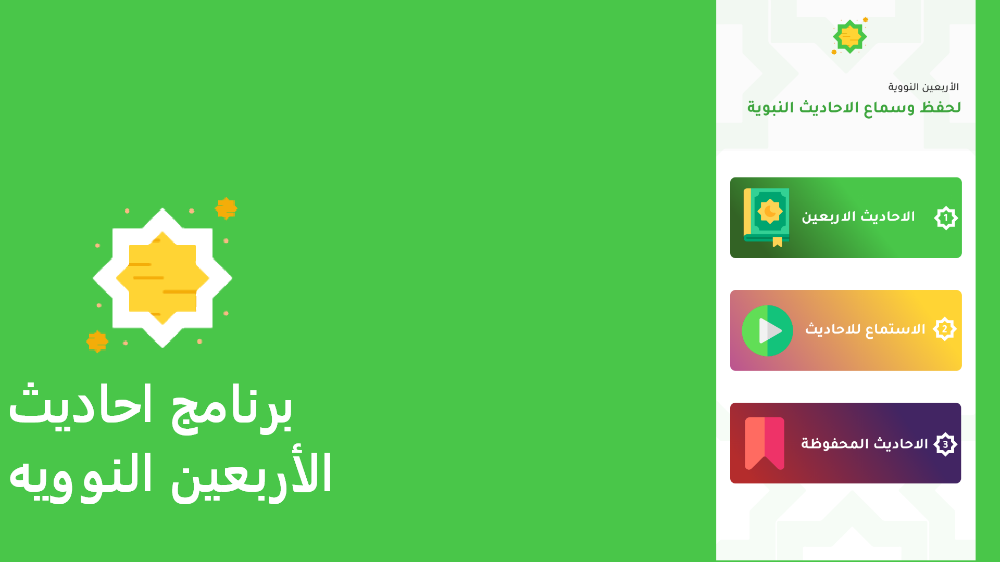
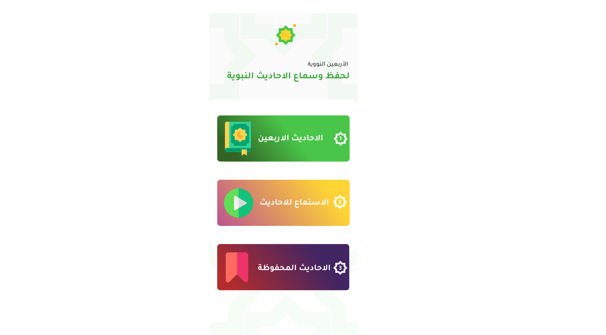
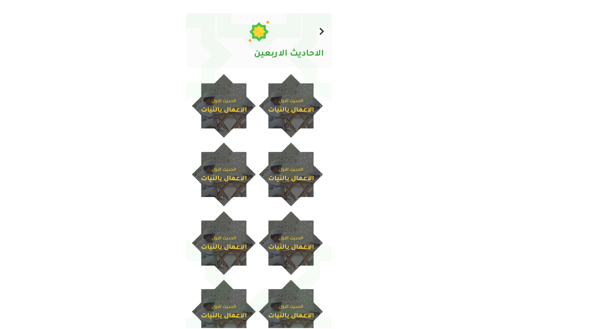
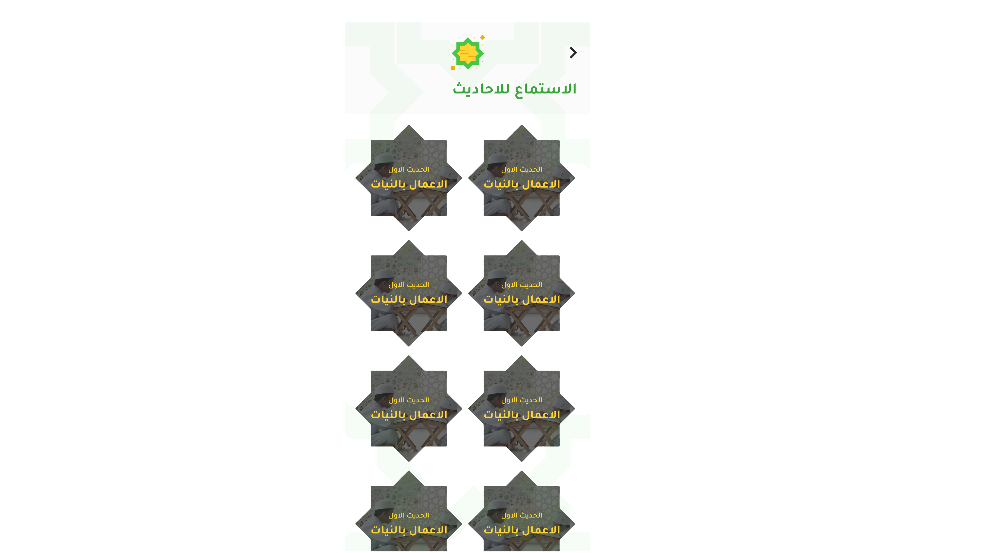
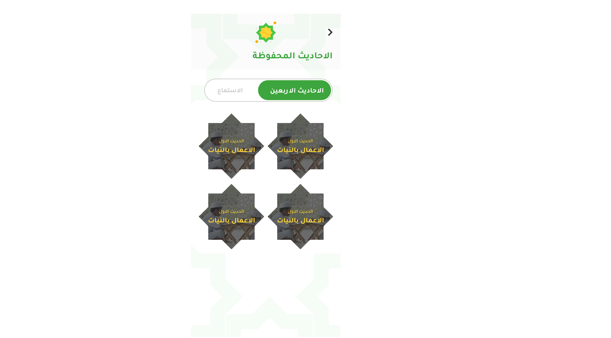
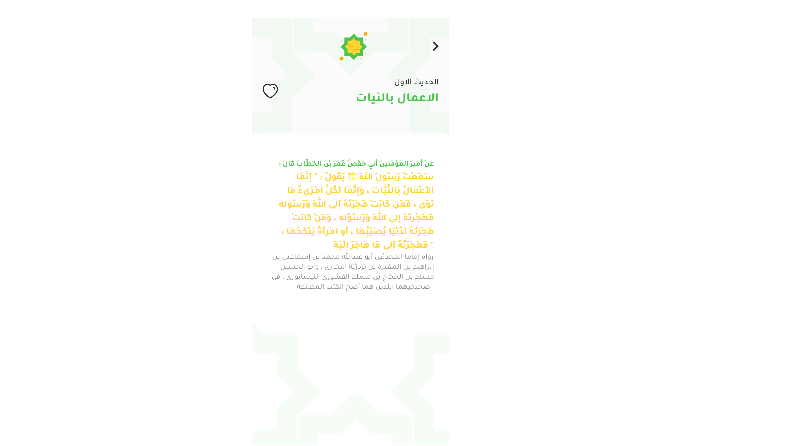

# الاربعون النوويه ✍🏻
Ahadith App with AudioPlayer [MVC pattern] 👨🏻‍💻

Ahadith App app is open-source  app for Android & ios. It is built with Dart on top of Google's Flutter Framework.

<b>ألاربعون النوويه</b>

##:rocket: youtube Tutorial

- Quiz App by GetX Link: [youtube](https://www.youtube.com/watch?v=sv4wBvkLPdo)
- Quiz App by GetX Link: [Quiz](https://www.youtube.com/watch?v=CasRDoWlPcY&t=899s&ab_channel=SecitDevelopers)
- Note App by GetX Link: [Note](https://www.youtube.com/watch?v=ZrDK3fG4PO0&t=198s&ab_channel=SecitDevelopers)
- news App Api by GetX Link: [News](https://www.youtube.com/watch?v=MFjoIT3RJSc&list=PLI36SLicSOmKQMPwPauvWDARjzrlQyLIo&index=21&ab_channel=SecitDevelopers)
- Ecommerce App by GetX Link: [MakeUp](https://www.youtube.com/watch?v=-bwiujixOpU&list=PLI36SLicSOmKQMPwPauvWDARjzrlQyLIo&index=3&ab_channel=SecitDevelopers)
- Qr Code: [Qr Code](https://www.youtube.com/watch?v=-QCrf5EytSc&list=PLI36SLicSOmLSQCD1Ccw7gazmeBlcAsAj&ab_channel=SecitDevelopers)
- Voice to Text App: [Voice to Text App](https://www.youtube.com/watch?v=dpdnvSI0Dn8&list=PLI36SLicSOmLSQCD1Ccw7gazmeBlcAsAj&index=2&ab_channel=SecitDevelopers)
- GetX EcoSystem playList Link: [PlayList](https://www.youtube.com/watch?v=8Jy4dtQOZMQ&list=PLI36SLicSOmKQMPwPauvWDARjzrlQyLIo&index=1)

## About🤠

الأربعون في مباني الإسلام وقواعد الأحكام المعروفة بـ الأربعون النووية، متن اشتمل على اثنين وأربعين حديثاّ جمعها يحيى بن شرف النووي المتوفى 676 هـ.

## Benfit👻
- [🖥] # Screens 🖥
- [🆗] Splash Screen
- [🆗] Home Screen
- [🆗] Ahadith Screen
- [🆗] Fav Video Screen
- [🆗] Audio Ahadith Screen
--------------------------------
- [x] [AudioPlayer]
- [x] [path_provider]
- [x] [flutter_svg]
- [x] [share]

--------------------------------
- [x] MVC patterns
-------------------------------
- [🖥] # Deal With 🖥
- [x] Deal With RegExp
- [x] Deal With RichText
- [x] Deal With Duration
- [x] Deal With AudioCache
- [x] Deal With localFilePath
- [x] Deal With Map Function

------------------------------
- [🖥] # Play  🖥
- [x] Pause
- [x] Stop
--------------------------

## Snapshots

| Splash Screen | Home Screen|
|------|-------|
|||

| Ahadith Page | Audio Page|
|------|-------|
|||

| BookMark Page | Ahadith Detail Search |
|------|-------|
|||

| Audio Detail
|------
|

## Other Flutter Projects 🔐
- [Youtube Clone App](https://github.com/itsherifAhmed/youtube-clone-app-Getx-youtube-Data-api-V3)
- [Quiz App](https://github.com/itsherifAhmed/Quiz-app)
- [News App](https://github.com/itsherifAhmed/NewsApp)
- [Device Detail App](https://github.com/itsherifAhmed/device-detail-app)
- [White board Draw App](https://github.com/itsherifAhmed/draw-app)
- [music app player external storage read](https://github.com/itsherifAhmed/Music-Player-Read-external-Storage-Flutter-app)
- [Make Up App flutter MVC Getx](https://github.com/itsherifAhmed/MakeUp-App)
- [Speech to Text app flutter](https://github.com/itsherifAhmed/Speech-to-text-app)
- [api flutter project](https://github.com/itsherifAhmed/apiFlutter-Project)
- [qr code app](https://github.com/itsherifAhmed/qr-barcode)
- [facebook ui clone](https://github.com/itsherifAhmed/facebook-ui-clone)
- [Login Screen](https://github.com/itsherifAhmed/login-screen)

## Dependencies 💤
 -  `path_provider:`
 -
 -  `flutter_svg:`
 -
 -  `audioplayers:`
 -
 -  `share:`
 -
